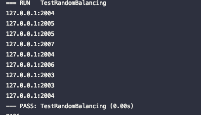
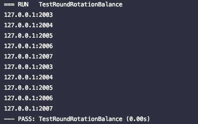
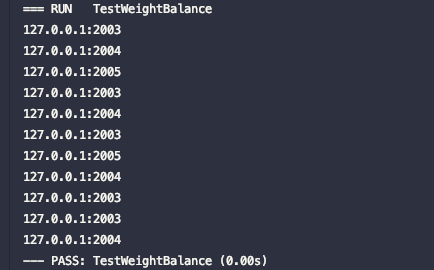

### <p align="center">loadbalance</p>
#### <p align="center">Random, round-robin, weighted, hash load balancing</p>
#### <p align="center"><a href="https://github.com/jeffcail/loadbalance/releases"></a><a href="https://github.com/jeffcail/loadbalance/blob/master/LICENSE"></a><p>
#### <p align="center"><a href="./README.md" target="_blank">Simplified Chinese</a> | <a href="./README_en.md" target="_blank">English</a> </p>

### Install
```shell
go get github.com/jeffcail/loadbalance
```

### E.g
#### 1. random
```go
r := &RandomBalancing{}
r.Add("127.0.0.1:2003")
r.Add("127.0.0.1:2004")
r.Add("127.0.0.1:2005")
r.Add("127.0.0.1:2006")
r.Add("127.0.0.1:2007")

fmt.Println(r.Next())
fmt.Println(r.Next())
fmt.Println(r.Next())
fmt.Println(r.Next())
fmt.Println(r.Next())
fmt.Println(r.Next())
fmt.Println(r.Next())
fmt.Println(r.Next())
fmt.Println(r.Next())
```


#### 2.Rotation Training
```go
r := &RoundRotationBalance{}
r.Add("127.0.0.1:2003")
r.Add("127.0.0.1:2004")
r.Add("127.0.0.1:2005")
r.Add("127.0.0.1:2006")
r.Add("127.0.0.1:2007")

fmt.Println(r.Next())
fmt.Println(r.Next())
fmt.Println(r.Next())
fmt.Println(r.Next())
fmt.Println(r.Next())
fmt.Println(r.Next())
fmt.Println(r.Next())
fmt.Println(r.Next())
fmt.Println(r.Next())
fmt.Println(r.Next())
```


#### 3.weight
```go
r := &WeightBalance{}
r.Add("127.0.0.1:2003", "4")
r.Add("127.0.0.1:2004", "3")
r.Add("127.0.0.1:2005", "2")

fmt.Println(r.Next())
fmt.Println(r.Next())
fmt.Println(r.Next())
fmt.Println(r.Next())
fmt.Println(r.Next())
fmt.Println(r.Next())
fmt.Println(r.Next())
fmt.Println(r.Next())
fmt.Println(r.Next())
fmt.Println(r.Next())
fmt.Println(r.Next())
```


#### 4. Consistent hashing
```go
r := NewConsistentHashBalance(10, nil)
r.Add("127.0.0.1:2003")
r.Add("127.0.0.1:2004")
r.Add("127.0.0.1:2005")
r.Add("127.0.0.1:2006")
r.Add("127.0.0.1:2007")

fmt.Println(r.Get("http://127.0.0.1:2002/base/getinfo"))
fmt.Println(r.Get("http://127.0.0.1:2002/base/errinfo"))
fmt.Println(r.Get("http://127.0.0.1:2002/base/getinfo"))
fmt.Println(r.Get("http://127.0.0.1:2002/base/pwd"))

fmt.Println(r.Get("127.0.0.1"))
fmt.Println(r.Get("192.168.0.1"))
fmt.Println(r.Get("127.0.0.1"))
```
